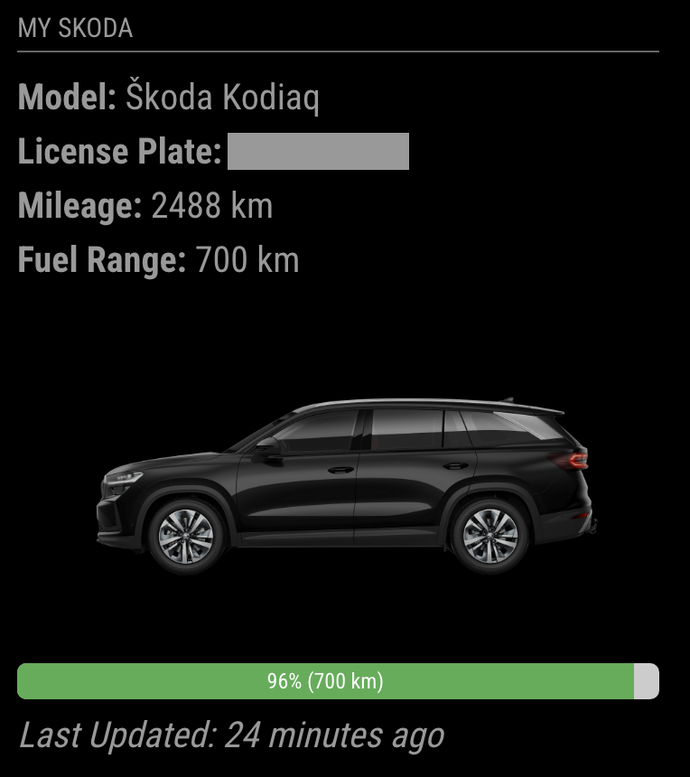

# MMM-MySkoda
Magic Mirror Module to display data from MySkoda for your car(s).

The module displays the model name, license plate, mileage, fuel range, and car image renders. It also shows the time the MySkoda API last received data from the car.

If you own several Skoda cars, you can configure a module for each of them. The module configuration requires the vin number of the car to separate multiple module instances.

The module is based on MySkoda Python library [myskoda](https://github.com/skodaconnect/myskoda) which is used to query the MySkoda API.

## Requirements

**A working python 3 distribution with pip is required before the installation.**
More specifically, Python <4.0, >=3.12.0.
If you are not on the needed version of python (python --version), you need to install a higher version of Python. I did do it by following this article [Python-RaspberryPi](https://aruljohn.com/blog/python-raspberrypi/), with an exception, that I did dowload Python 3.13.0, but mentioned Python 3.12.3 could work too.
Then, I've had issues with using the system Python for the npm install, so I had to create a Python Virtual Environment. I did do it by following those commands:

    python3 -m pip install --upgrade pip
    pip3 install virtualenv
    pip3 install --upgrade setuptools
    which python3

Then I went to the MagicMirror folder and followed by calling those commands by using the outcome of the "which python" in the following virtualenv command for the python3 filepath

    virtualenv -p /usr/bin/python3 venv
    source venv/bin/activate

Once done, I was able to successfully finish the installation.

## Installation

Clone this repository in your modules folder, and install dependencies:

    cd ~/MagicMirror/modules
    git clone https://github.com/OPlevka/MMM-MySkoda
    cd MMM-MySkoda
    npm install 

Should the installation fail on the missing Rust, follow the official [Rust-Installation](https://www.rust-lang.org/tools/install) and don't forget to restart the console.

## Configuration

Go to the MagicMirror/config directory and edit the config.js file. Add the module to your modules array in your config.js.

You'll need your MySkoda email and password, and your car's VIN number.

Enter these details in the config.js for your MagicMirror installation:

        {
            module: "MMM-MySkoda",
            position: "top_right",
            config: {
                email: "email@example.com",
                password: "myComplexPassword",
                vin: "XXXXXXXXXXXXXXXXX"
            }
        },

## Running
If you run the MagicMirror manually, don't forget to run the Python venv activation command before you run the 'npm run start' command by running the following command in its respective folder (in my case the MagicMirror folder):
    source venv/bin/activate

If you run the MagicMirror through the PM2 auto start, locate the mm.sh and add the Python venv activation in the mm.sh like mentioned [here](https://forum.magicmirror.builders/topic/18652/pm2-auto-start-and-python-virtual-environment-not-playing-together/2). In my case the mm.sh looks like this
    cd ./MagicMirror
    source venv/bin/activate
    DISPLAY=:0 npm start

## Changelog

**2024-12-03** Python venv guide
**2024-12-01** First version

## Thank you
Thanks [MM-MyBMW](https://github.com/Jargendas/MMM-MyBMW) for inspiration